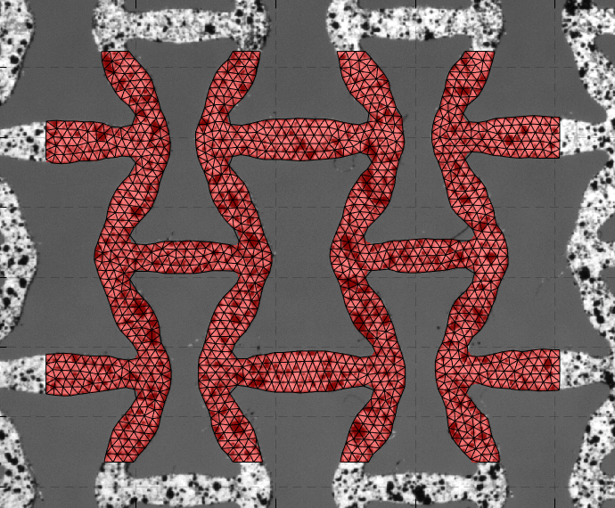

# ArchiDIC: Two-scale Digital Image Correlation
*A suite of MATLAB scripts dedicated to the kinematical characterization of architectured structures*

### What do these scripts do ?
- `Meshing` the structure from a reference image
- Mesh-based `Global DIC` for the identification of *microscopic* kinematics
- Feature-based `Local DIC` for the quantification of *macroscopic* kinematics

### How to test the proposed procedures ?
1. `copy` the repository content in a folder
2. make this folder the MATLAB's `Current Folder`
3. run `main.m`

## Meshing the structure using a reference image

This procedure is intended to mesh complex geometries using a reference picture that is used to extract the object's boundaries.
It makes use of the [DistMesh](http://persson.berkeley.edu/distmesh/) procedure by Per-Olof Persson to produce high-quality triangulations of the geometry.

### Extraction of the `Region Of Interest`

Starting from an image `I` of the geometry, the Region Of Interest (or mesh interior domain) consists in a *binary mask* with 1's *inside* the geometry and 0's *outside*.
It is created in three steps:
1. Substraction of the image background gray level `b = I[refPt]` so that `I = abs(I-b)`
2. Initialize the mast `M` by gray level thresholding using `M = I>t`
3. Order-statistic filtering of the mask with `M = ordfilt2(M,ord,K)`, which is equivalent to `M = conv2(M,K)>=ord` ; the binary filter kernel `K` is a disk of radius `R`.

The parameters of the procedure are then the reference frame `I`, the reference background point `refPt`, the threshold value `t`, the statistical order `ord` as well as the kernel radius `R`. They can be tuned using the dedicated GUI:

 
   

where the resulting binary mask `M` is represented by red pixels.

### Computation of the `Signed Distance Function`

The [DistMesh](http://persson.berkeley.edu/distmesh/) procedure uses a [level-set](https://en.wikipedia.org/wiki/Level_set) representation of the geometry boundaries: a *Signed Distance Function* `fd(p)` is defined for *any* point `p` so that `fd(p)<0` if `p` is *inside* the geometry, `fd(p)>0` if `p` is *outside* the geometry, and `abs(fd(p))` is the distance between `p` and the closest point to the boundaries. These boundaries are, as a consequence, defined by `fd(p)=0`.

In the present case, `fd(p)` is defined as the bilinear interpolation of a *Signed Distance Image* (SDI). This SDI is computed from the mask obtained previously using the [Distance Transform](https://en.wikipedia.org/wiki/Distance_transform): `SDI = bwdist(MASK)-bwdist(~MASK)`. An example of such SDI is shown below:

 
   

where a `margin` is added in order to avoid *leaks* of points too close to boundaries during mesh generation.

### Generation of the `Mesh`

In addition to the level-set function `fd(p)`, the [DistMesh](http://persson.berkeley.edu/distmesh/) procedure takes several other arguments:
- a *density function* `fh(p)` that returns, for any point `p` , the *target local edge length* 
- an *intial* density value `h0` that is used to populate the mesh at the beginning of the procedure
- the *bounding box* `bbox`: any points going outside is culled
- an optionnal list of *fixed points* `pFix` that can be used to sample special features, clamps, etc.

The mesh generation procedure begins by populating the geometry with a given distribution of points `p0` of approximative density `h0`. Starting from this *initial* configuration, the mesh is *relaxed* by solving a truss-like non-linear static force equilibrium with an *explicit scheme*:

1. Trangular elements defined as a [Delaunay triangulation](https://en.wikipedia.org/wiki/Delaunay_triangulation) of the *current configuration* `p`
2. Elements laying *oustide* the geometry, such that `fd(centroid)>deps`, are deleted
3. The *configuration update* `dp` is computed using the difference between the *current edge length* `L` and the *target* edge length `fh`
4. The points `p = p + deltat*dp` that belong to the mesh boundaries are projected back to the level-set

This procedure is repeated *until convergence*, i.e as long as `norm(dp)>dptol`. An example of obtained mesh is shown below:

 
   

The parameters `deps`, `deltat` and `dptol` are setted on the `distmesh2d` procedure. In order to be adapted to the present applications, some minor modifications have been done on the original script; the file now used to generate the mesh is `functions/distmesh2d_modif`.

## Digital Image Correlation: generalities
*work in progress..*

## Global DIC

## Local DIC
